# Choose visually distinct N-sized colour palettes from a list of colours
In our product, we display driving route lines on a map.
Customers usually have between 5 and 30 routes, and by default
our product automatically chooses the colours for them.


## Colour Palette Criteria
Colours in a palette must be:
- Visually distinct from each other
- Visually distinct from colours on the map
- Reasonably visible (not too light or dark)
- Aesthetically pleasing

## Approach

1. Create a shortlist of colours which are all aesthetically pleasing, and meet our criteria
2. Split these colours into N groups which are as visually distinct as possible
3. Choose a colour from (or generate a colour based on) each group to create our palette


## The Shortlist
The aim of making a shortlist is to ensure that all colours are "visually pleasing".  
Of course, this is subjective, but I can at least remove jarring colours (like #FF0000 , #00FF00 and #0000FF for example).

I hand picked colours from a [Canva article with 100 colour palettes](https://www.canva.com/learn/100-color-combinations/)
and put them in [colours.py](colours.py)

[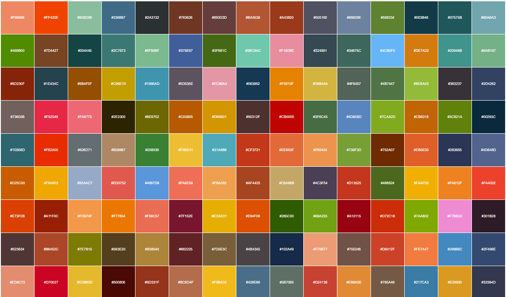](https://htmlpreview.github.io/?https://github.com/treharne/colours/blob/main/all_colours.html)
This is about half of the ~230 colours. It's worth noting that many are quite similar!

You can see them in [all_colours.html](https://htmlpreview.github.io/?https://github.com/treharne/colours/blob/main/all_colours.html)

I mostly accepted all the colours, except:
- Whites, greys and blacks, since they're boring
- Colours which are too light to use as a background with white text


## Removing map-like colours
By default, we use this map from [Maptiler](https://www.maptiler.com/maps/#basic//vector)

[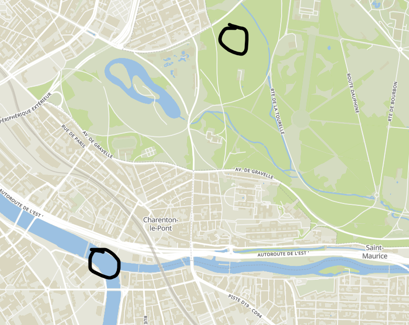](https://www.maptiler.com/maps/#basic//vector)

So we want to avoid colours that are too visually similar to the blue and green used in it.

[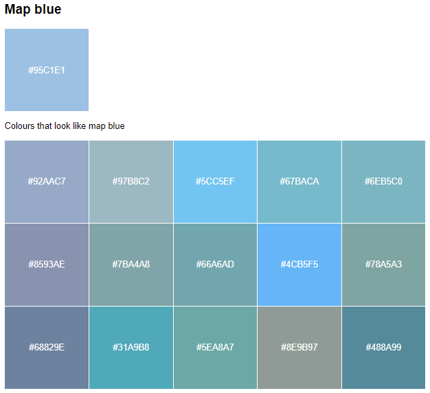](https://htmlpreview.github.io/?https://github.com/treharne/colours/blob/main/maplike_colours.html)

[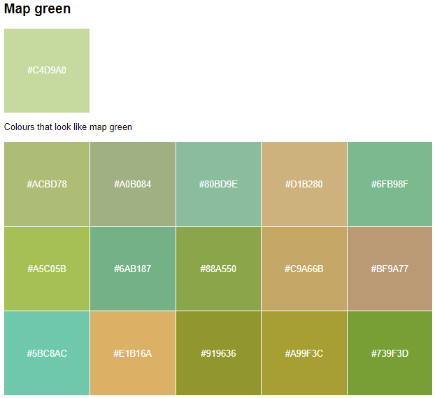](https://htmlpreview.github.io/?https://github.com/treharne/colours/blob/main/maplike_colours.html)

Since I already had in mind not to choose map-like colours, we don't have too many that are too close. But these are the closest ones using euclidean distance on `L*a*b` colours (read on to find out what that is!).

I manually removed some of these maplike colours from our shortlist.

**Can't you just change the map style?**  
Yes, our users can change the map style that they use. But we just want to make sure our colours work well with the default one, since thats what most users use.


## Group the colours
We need an algorithm which can:
- Group the colours into a [predetermined number of groups](https://en.wikipedia.org/wiki/Cluster_analysis#Centroid-based_clustering)
- Do this based on some kind of distance metric: Colours in the same group should be the most similar

[K-means](https://en.wikipedia.org/wiki/K-means_clustering) seems like a good choice!  
I'll use [Scikit-learn K-means](https://scikit-learn.org/stable/modules/generated/sklearn.cluster.KMeans.html) for this project.

I also tried [Spectral Clustering](https://en.wikipedia.org/wiki/Spectral_clustering) which (after tuning) gave quite similar results to K-means.

### Problem: Bad Clusters
The first time I ran the algorithm using RGB values for each colour, there were some pretty good clusters:

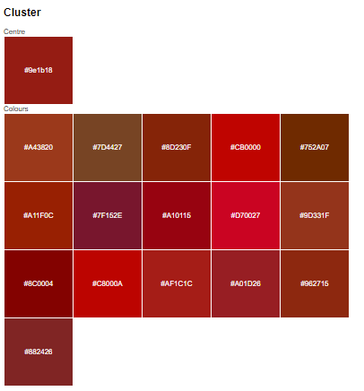
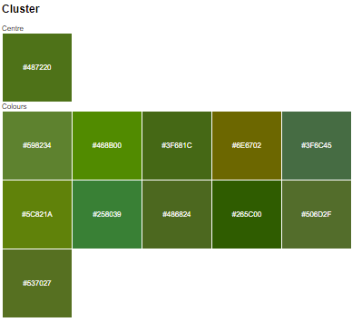

but also some clusters which seemed "bad" in my opinion: 

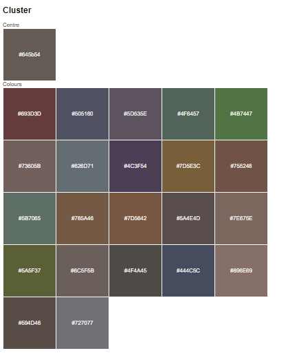
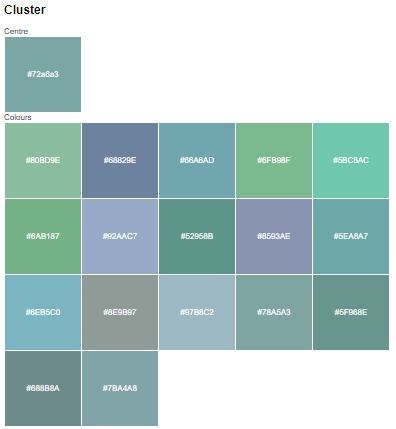

The goal of this project is to get colours that are visually distinct into different clusters. But many colours in this cluster are quite visually distinct.... so shouldn't they be in different clusters?

I can understand why the algorithm did it like this - it seems like they're all fairly dark colours on the left, or fairly light colours on the right.

But I want to do better.  
It doesn't seem correct to have navy, mustard, purple, dark green, and red-wine in the same cluster.

(if you're curious, you can see the results with N=15 using RGB in [clustered_colours_rgb.html](https://htmlpreview.github.io/?https://github.com/treharne/colours/blob/main/clustered_colours_rgb.html))

### Solution: Better Colour Representation
Wow... colour theory is a rabbit hole.

TLDR:
- The (euclidean) distance between two RGB colours doesn't represent very well how differently we perceive them
- There's an alternative notation for colours called `L*a*b`, which is [designed to better represent human colour perception](https://en.wikipedia.org/wiki/CIELAB_color_space#Advantages).


So I converted all my colours from RGB into `L*a*b` before clustering them.

This *substantially* improved the groupings:

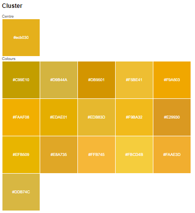
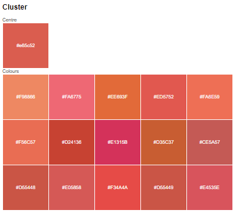

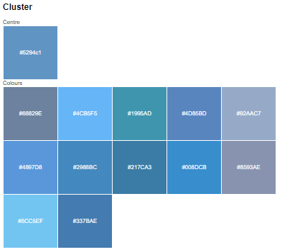
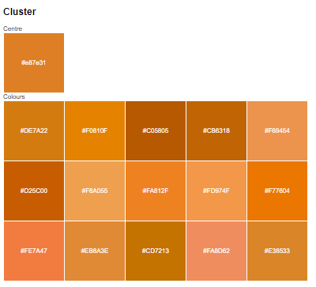

You can see the result with N=15 using `L*a*b` colours in [kmeans_clustered_colours.html](https://htmlpreview.github.io/?https://github.com/treharne/colours/blob/main/kmeans_clustered_colours.html)

## Choose a colour from each Palette
There are a few obvious approaches here:
- Randomly choose a colour from each group
- Take the mean of each group
- Take the median of each group (what does this mean?)

Since I was using K-means, the simplest was to take the mean.

I'm not completely happy with this, since it means that my final colours are *not* colours that I originally put in the shortlist.  
This might be worth revisiting.

**Update:** Now we're using medians. There is very little change to the palettes generated, but all colours are shortlist colours, which I think is important since you went to the effort of making a shortlist anyway!

## Incremental filtered colour palettes
Subjectively, of all the colours I picked, I like some more than others.

So I split the colours into a few groups (HSV colour representation was useful for this):
- Pastel Colours
- Bright Pastel Colours
- Bright Colours
- Strong Dark Colours
- Dull Colours

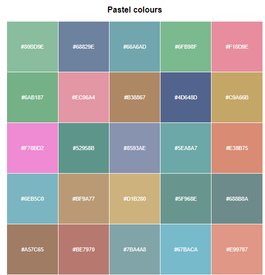
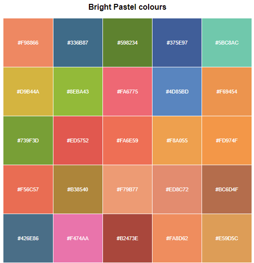
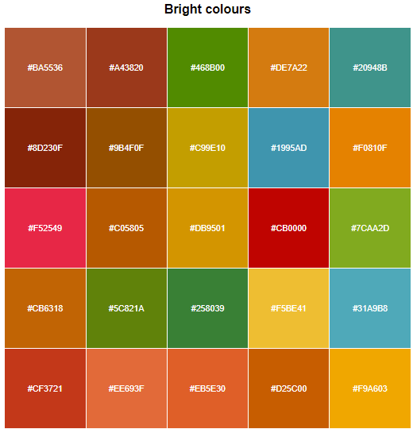

I like some of these groups more than others, so I only fed a subset of them to the clustering algorithm when we only need to generate a small number of colours.

```python
    if palette_size > 0:
        allowed_filters.append(is_bright_pastel)
        allowed_filters.append(is_pastel)
    if palette_size > 11:
        allowed_filters.append(is_bright)
    if palette_size > 19:
        allowed_filters.append(is_strong_dark)
    if palette_size > 30:
        allowed_filters.append(is_dull)
```

This means that:
- For smaller palette sizes, we have more beautiful colours, and
- For larger palette sizes, we have more colour diversity so we can make more contrasting colours.


# Results


## Random vs RGB vs `L*a*b`
**Random colours from Shortlist**  

[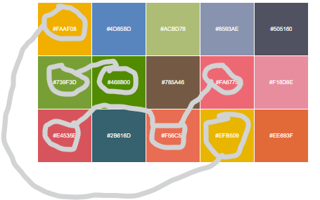](https://htmlpreview.github.io/?https://github.com/treharne/colours/blob/main/random_colours.html)

Quite a few colours have very close pairs.

**RGB + K-means**  

[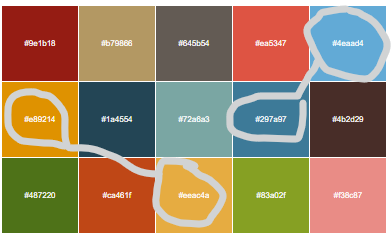](https://htmlpreview.github.io/?https://github.com/treharne/colours/blob/main/clustered_colours_rgb.html)

Some close pairs

**`L*a*b` + K-means**  

[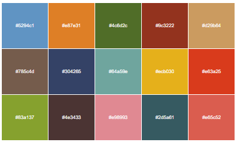](https://htmlpreview.github.io/?https://github.com/treharne/colours/blob/main/kmeans_clustered_colours.html)


Fewer close pairs. Pinks and browns are arguably worse than RGB. Greens, blues, yellows definitely better than RGB.

Of course, as always, this is subjective.


## Spectral vs K-means clustering
TLDR: Both work well, I subjectively prefer K-means in this case.

For the algo-curious amongst you:
- K-means generates a "distance matrix" between all points, then creates clusters of equal radius (from the means)
- Spectral clustering creates a nearest-neighbour graph, and creates clusters of equial affinity (think "neighbour-ness")
- Therefore K-means always produces "spherical" clusters, but spectral can handle very different shaped clusters.
- Since we represented our colours using `L*a*b`, which *is designed for using distances between colours as their perceived difference*, K-means seems to fit this representation perfectly.
- Subjectively, I slightly preferred the palettes generated by K-means. (but this doesn't mean that they are "technically" better by any measure of clustering goodness)

You can see a side-by-side comparison in [filtered_palettes.html](https://htmlpreview.github.io/?https://github.com/treharne/colours/blob/main/filtered_palettes.html)


## Colour Palettes for N <= 40
[filtered_palettes.html](https://htmlpreview.github.io/?https://github.com/treharne/colours/blob/main/filtered_palettes.html) has the colour palettes generated using this methodology (K-means vs Spectral on `L*a*b`) for each palette size from 1 to 40.

[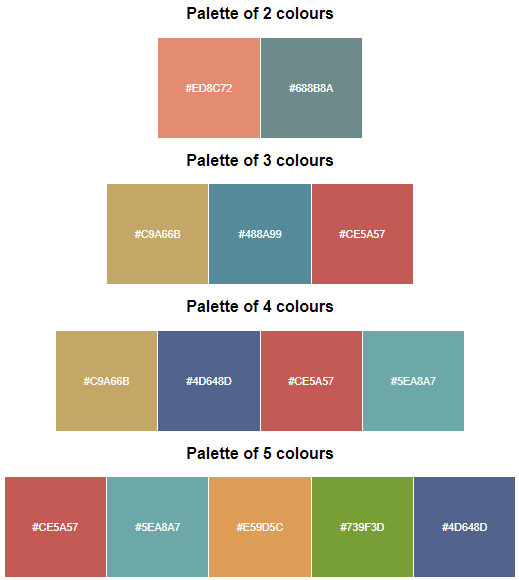](https://htmlpreview.github.io/?https://github.com/treharne/colours/blob/main/filtered_palettes.html)

[colour_palettes.json](colour_palettes.json) has the same colours, but as json.  
You can get each palette from this file using
```python
# n is the number of colours you need in your palette
colour["palettes"][n]
```


# To do
- Add images of the final result routes on map